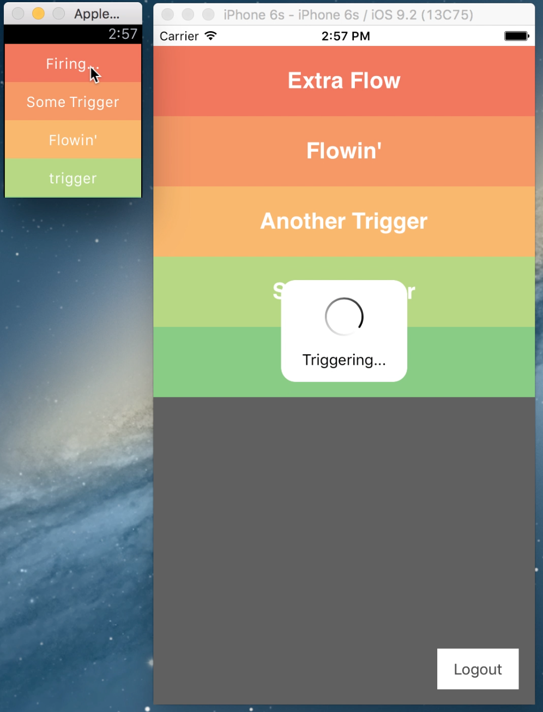

#Blu for iOS

Trigger insanity



## Setup

1. This project uses [CocoaPods](http://cocoapods.org), so make sure you have the `pod` command installed, i.e. using [Homebrew](http://brew.sh):

 ```
 brew install Caskroom/cask/cocoapods
 ```

1. Install all CocoaPods dependencies:

 ```
 pod install
 ```
1. Open/Build the generated `Blu.xcworkspace` and run the `Blu` scheme/target using Xcode IDE/CLI or [ios-deploy](https://www.npmjs.com/package/ios-deploy).

## Watch App & Glance

The `BluWatch` & `Glance - BluWatch` schemes allow to run the Apple Watch application and glances respectively.

Both components require that the iOS app is run and authentication is completed in order to fetch the flows/triggers.

Once authenticated, you may use the Apple Watch iOS app to enable both the Blu Watch app and its glance (the latter will simply provide a shortcut to retrigger the last invoked trigger).
